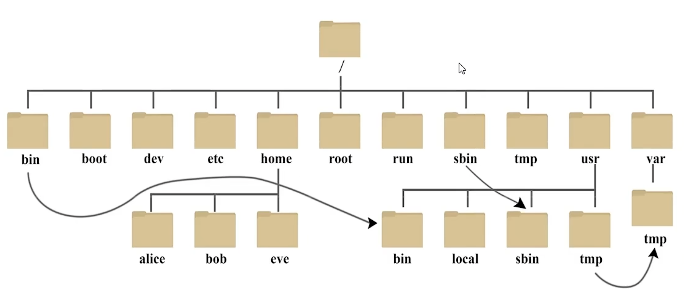

# linux 笔记

---
> [Linux基础课](https://www.bilibili.com/video/BV1wF4m1N7BF?p=1&vd_source=e72b19c11ff9d91211ff43b2fe7d0992)
---

> 其他说明：

> `.` 当前目录

> `..` 上一级目录

> `lscpu` 查看本机cpu信息

> `uname-a` 指令查看本机信息

> `lspci` 命令用于显示所有PCI总线上的设备信息，包括显卡、网卡等。

> `lsusb` 命令用来显示所有USB总线和连接的设备信息。

> `cat /etc/os-release` 这个命令可以查看当前操作系统的版本信息和相关细节。

> `df` 命令用来查看文件系统的磁盘空间占用情况，`-h`参数表示以人类可读的格式显示。

---

## 1-ls与cd

### ls
- `ls`：
    list的缩写，列出目录信息具

    - -l：long，长文显示更详细内容如权限，左右，大小等

    - -a：all，显示所有文件与目录（包括用`.`开头的隐藏文件）

    - -h：显示文件大小

> 命令可连写：`ls -alh`

> 具体可以`man ls`查看ls使用方法与参数说明

> 通常shell写法中--后加小写，-后加大写

### cd
- `cd`:

    change directory缩写，改变目录

### pwd
- `pwd`:

    是print working directory,打印工作目录，即显示当前所在目录的绝对路径

---

## 2-系统文件和目录结构

|目录|说明|
|--|--|
|/bin|是Binaries（二进制文件）的缩写，命令|
|/mnt|/opt/media用于挂载的空目录|
|/boot|启动文件目录|
|/dev|是Device（设备）缩写|
|/etc|主要放置应用配置文件|
|/root|root管理员目录（特殊目录）|
|/home|用户目录|
|/run|运行时目录|
|/sbin|s指Super User,存放管理员用户使用的命令|
|/tmp|temporary的缩写，临时文件|
|/usr|是unix shared resources（共享资源）的缩写，主要存放应用程序文件|
|/var|是variable（变量）的缩写，存放缓存和一些需要动态变化的文件|
|/proc|是Process（进程）的缩写||

> 详细请执行 `ls /`，或执行`sudo apt install tree`安装tree cli后执行`tree /`，也可方便查看执行`tree / >> ~/yourLinuxDir_info.txt`,执行完后双击打开个人主目录下`yourLinuxDir_info.txt`文件

---

## 3-文件拷贝与复制

### cp
- `cp 源 目标`

    copy缩写，用于复制粘贴

    `cp source dest` （如果dest文件不存在就创建，存在就覆盖）

    `cp source1 source2 source3 source... dest` （复制source123..到已存在的dest目录）

    `cp -r 源目录 目标目录` （复制递归复制源目录文件到目标目录）

### mv
- `mv 源 目标`

    move的缩写，转移

    `mv source dest` （如果dest文件不存在就创建，存在就覆盖）

    `mv source1 source2 source3 source... dest` （复制source123..到已存在的dest目录）

    `mv -r 源目录 目标目录` （复制递归复制源目录文件到目标目录）

    `mv 源文件 同路径下新文件名`（重命名）

---

## 4-文件创建与删除

### touch
- `touch file1 file2 ...`

    `touch filename` 不存在就创建，否则修改创建时间，
    
    `touch file{1..30}`  序号文件
    
    - 参数
        
        -t，指定文件创建时间
        
        `touch -t 111234.6 filename`

### mkdir
- `mkdir dir1 dir2 ...`

    `mkdir dirname` 创建目录
    
    `mkdir dirname{1..30}` 序号目录

    
    - 参数
        
        -p，连级创建目录
        
        `mkdir ~/Desktop/mytest/t1/t2`

### ▲ rm
使用删除目录是需要查看一遍指令是否错误防止删除错误，导致其他后果如删库跑路: ~rm -rf~
- `rm [-rf] filename/dir`
    -f > force强制武力的，在这里是强制删除，主要是用来忽略警告
    -r > 递归删除层级目录

## 5-读取文本文件内容

### cat
- `cat filename # 必须为文本文件`
    - 参数
        -n #参数显示行号
        `cat -n filename`
    - 例
        `cat file1 > file2` # 将file1文件中的内容复制到file2中 可加-n增加行号
        `cat file1 |grep -i word` # 返回word所在的一行,忽略大小写

### head

- `head [参数] filename` # 文本文件
    - 参数
        -n #显示头几行
        `head -5 filename`
        -f 
    - 例
        ` head -n 2 filename1` #显示filename1的前两行

### tail

- `tail [参数] filename` # 文本文件
    - 参数
        -n #显示头几行
        `tail -5 filename`
        -f # 实时显示添加到末尾的行，用于实时跟踪日志
    - 例
        ` tail -n 2 filename1` #显示filename1的最后两行

## 6-分屏阅读信息

- more filename #分屏阅读
    - 前进行：回车键
    - 后退行：空格键
    - 退出：q
    - 扩展
        - cat file | more
        - history | more

- less--更强大的分屏阅读

- 基本用法： `less filename`
    - 前进 ↑ ↓
    - 后退 pgup或bpgdn或空格

- 扩展用法：
    - car filename | less
    - history | less

- 和 more 的区别 
    - more 只能前进不能随意看
    - cat more 都加载文件全部，less 只加载部分，多大文件有好作用

## 7-文件编辑器vi初步

## 8-文件编辑器vi扩展

## 9-文件权限属性修改

## 10-文件查找find_locate与通.
